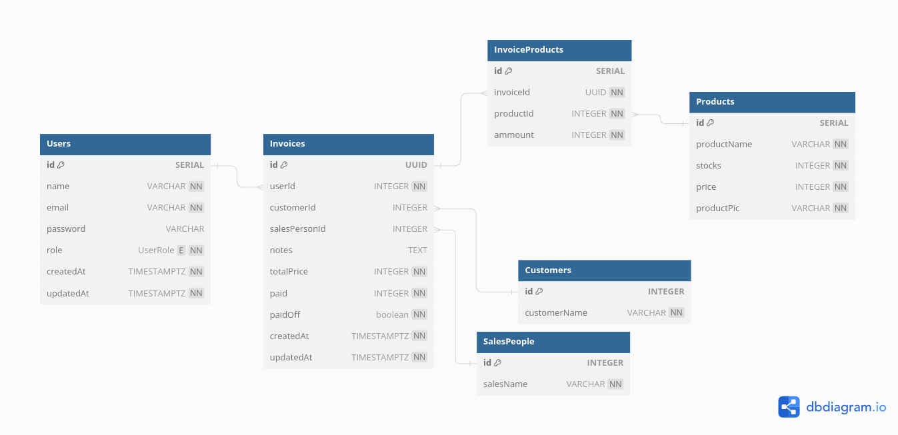

# Table of contents
1. [Project Details](#project-details)
2. [How to Run on Local Machine](#how-to-run-on-local-machine)
3. [E-faktur Design](#e-faktur-design)
    1. [Entity Relation Diagram](#entity-relation-diagram)
    2. [Application Flow Diagram](#application-flow-diagram)
    3. [Application Design Challenges and Implementations](#application-design-challenges-and-implementations)

## Project Details

## How to Run on Local Machine

## E-faktur Design

### Entity Relation Diagram

#### [Online Schema](https://dbdiagram.io/d/e-faktur-65ef2361b1f3d4062ca396c4)

### Application Flow Diagram

### Application Design Challenges and Implementations